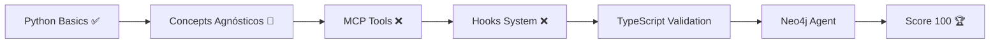

# 👤 Perfil do Bootcamp - Diego Fornalha

## 📊 Status Atual

- **Nome**: Diego Fornalha
- **Email**: diegofornalha@gmail.com
- **Score**: 45/100
- **Nível**: Iniciante avançando para Intermediário
- **Semana**: 1 de 12
- **Meta**: Expert em Claude Code SDK (Score 100)

## 🎯 Objetivos

### Curto Prazo (2 semanas)
- [ ] Dominar conceitos stateless vs stateful
- [ ] Completar exercícios Python básicos
- [ ] Entender async/await patterns
- [ ] Score 60

### Médio Prazo (6 semanas)
- [ ] **Resolver gap MCP Protocol** (+15 pontos)
- [ ] **Resolver gap Hooks System** (+10 pontos)
- [ ] Validar conhecimento em TypeScript
- [ ] Score 75

### Longo Prazo (12 semanas)
- [ ] Implementar Neo4j Agent completo
- [ ] Dominar orquestração multi-agent
- [ ] Contribuir com exemplos para o SDK
- [ ] Score 100

## 📚 Conhecimento Atual

### ✅ Dominado
- Conceito de SDK agnóstico
- query() básico
- Async patterns conceitual

### 🔄 Em Progresso
- ClaudeSDKClient
- Diferença stateless vs stateful
- Tool permissions

### ❌ Gaps Críticos
1. **MCP Protocol** (URGENTE)
   - Não sabe criar MCP tools
   - Não entende formato de retorno
   - Impacto: -15 pontos

2. **Hooks System** (IMPORTANTE)
   - Não sabe implementar hooks
   - Não entende Pre vs Post
   - Impacto: -10 pontos

## 🧠 Estilo de Aprendizado

- **Preferência**: Hands-on (aprender fazendo)
- **Linguagem Principal**: Python
- **Linguagem de Validação**: TypeScript
- **Melhor Horário**: Manhã
- **Sessões Ideais**: 2-3 horas focadas

## 💡 Insights Capturados

1. "Peças do quebra-cabeça começando a se encaixar"
2. "Python e TypeScript confirmam mesmos conceitos"
3. "SDK agnóstico é melhor abordagem"
4. "Neo4j melhor que Gmail para aprender"

## 🛤️ Caminho Personalizado

## 📈 Progresso por Semana

| Semana | Foco | Score Esperado |
|--------|------|----------------|
| 1 | Fundamentos | 45 → 48 |
| 2 | Client vs Query | 48 → 52 |
| 3 | Async Patterns | 52 → 56 |
| 4 | Tool Permissions | 56 → 60 |
| 5-6 | **MCP Protocol** | 60 → 75 |
| 7-8 | **Hooks System** | 75 → 85 |
| 9-10 | TypeScript | 85 → 92 |
| 11-12 | Neo4j Agent | 92 → 100 |

## 🔗 Recursos Prioritários

### Esta Semana
- `/bootcamp-claude-sdk/CONCEITOS/01_stateless_vs_stateful.md`
- `/bootcamp-claude-sdk/diegofornalha/01_fundamentos/`

### Próxima Semana
- `/bootcamp-claude-sdk/CONCEITOS/04_mcp_protocol.md`
- `examples/gap_1_mcp_tools_tutorial.py`

### Quando Travar
- Revisar conceitos agnósticos
- Comparar Python vs TypeScript
- Perguntar ao Neo4j Agent

## 🏆 Conquistas

- [x] Iniciou bootcamp
- [x] Configurou ambiente
- [x] Entendeu SDK agnóstico
- [ ] Primeiro MCP tool
- [ ] Primeiro hook
- [ ] Validação TypeScript
- [ ] Neo4j Agent funcional
- [ ] Score 100

## 📝 Notas Pessoais

- MCP é o maior bloqueio atual
- TypeScript confirma entendimento
- Neo4j > Gmail para aprender
- Conceitos > Sintaxe sempre

---

*Última atualização: 2025-09-23*
*Próxima revisão: Semana 2*