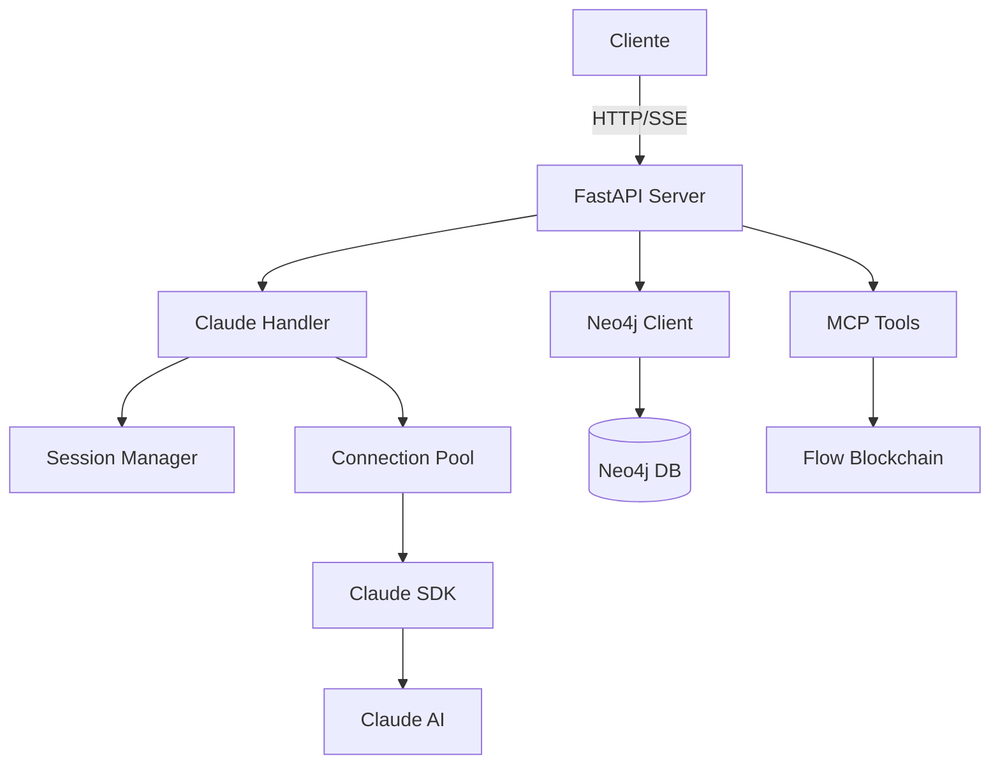

# 📚 Neo4j Agent Flow API - Documentação Master

## 🎯 Índice de Documentação Clusterizada

### 📊 Estrutura da Documentação

```
Nível 0: Visão Geral
    ↓
Nível 1: Conceitos Básicos
    ↓
Nível 2: Componentes Core
    ↓
Nível 3: Integrações
    ↓
Nível 4: Avançado
```

---

## 📖 Documentação por Níveis

### 🌱 **Nível 0 - Visão Geral**
- [01_OVERVIEW.md](./01_OVERVIEW.md) - Arquitetura geral e propósito
- [02_QUICK_START.md](./02_QUICK_START.md) - Começar em 5 minutos
- [03_PROJECT_STRUCTURE.md](./03_PROJECT_STRUCTURE.md) - Estrutura de pastas

### 🌿 **Nível 1 - Conceitos Básicos**
- [10_BASIC_CONCEPTS.md](./10_BASIC_CONCEPTS.md) - Conceitos fundamentais
- [11_API_ENDPOINTS.md](./11_API_ENDPOINTS.md) - Endpoints REST disponíveis
- [12_SSE_STREAMING.md](./12_SSE_STREAMING.md) - Server-Sent Events explicado
- [13_SESSION_MANAGEMENT.md](./13_SESSION_MANAGEMENT.md) - Gerenciamento de sessões

### 🌳 **Nível 2 - Componentes Core**
- [20_FASTAPI_SERVER.md](./20_FASTAPI_SERVER.md) - Servidor principal
- [21_CLAUDE_HANDLER.md](./21_CLAUDE_HANDLER.md) - Gerenciador do Claude
- [22_SESSION_MANAGER.md](./22_SESSION_MANAGER.md) - Manager de sessões
- [23_CONNECTION_POOL.md](./23_CONNECTION_POOL.md) - Pool de conexões
- [24_CLAUDE_SDK.md](./24_CLAUDE_SDK.md) - SDK do Claude Code

### 🔗 **Nível 3 - Integrações**
- [30_NEO4J_INTEGRATION.md](./30_NEO4J_INTEGRATION.md) - Banco de grafos
- [31_MCP_TOOLS.md](./31_MCP_TOOLS.md) - Model Context Protocol
- [32_FLOW_BLOCKCHAIN.md](./32_FLOW_BLOCKCHAIN.md) - Integração Flow
- [33_FRONTEND_REACT.md](./33_FRONTEND_REACT.md) - Interface React
- [34_WEBSOCKET.md](./34_WEBSOCKET.md) - Comunicação real-time

### 🚀 **Nível 4 - Avançado**
- [40_PERFORMANCE.md](./40_PERFORMANCE.md) - Otimizações
- [41_MONITORING.md](./41_MONITORING.md) - Monitoramento
- [42_ERROR_HANDLING.md](./42_ERROR_HANDLING.md) - Tratamento de erros
- [43_DEPLOYMENT.md](./43_DEPLOYMENT.md) - Deploy em produção
- [44_SCALING.md](./44_SCALING.md) - Escalabilidade

### 🔧 **Extras - Referências**
- [50_API_REFERENCE.md](./50_API_REFERENCE.md) - Referência completa da API
- [51_CODE_EXAMPLES.md](./51_CODE_EXAMPLES.md) - Exemplos práticos
- [52_TROUBLESHOOTING.md](./52_TROUBLESHOOTING.md) - Solução de problemas
- [53_FAQ.md](./53_FAQ.md) - Perguntas frequentes

---

## 🗺️ Mapa de Aprendizado Recomendado

### Para Iniciantes
```
1. 01_OVERVIEW.md
2. 02_QUICK_START.md
3. 10_BASIC_CONCEPTS.md
4. 11_API_ENDPOINTS.md
```

### Para Desenvolvedores
```
1. 20_FASTAPI_SERVER.md
2. 21_CLAUDE_HANDLER.md
3. 30_NEO4J_INTEGRATION.md
4. 31_MCP_TOOLS.md
```

### Para DevOps
```
1. 40_PERFORMANCE.md
2. 41_MONITORING.md
3. 43_DEPLOYMENT.md
4. 44_SCALING.md
```

---

## 📊 Diagrama de Componentes



---

## 🎯 Score por Documentação Lida

| Documento | Pontos | Pré-requisito |
|-----------|--------|---------------|
| Overview | +2 | Nenhum |
| Quick Start | +3 | Overview |
| Basic Concepts | +5 | Quick Start |
| Core Components | +10 | Basic Concepts |
| Integrations | +15 | Core Components |
| Advanced | +20 | Integrations |

**Total Possível**: 55 pontos

---

## 🔍 Como Navegar

1. **Começe pelo índice** (este arquivo)
2. **Siga a ordem numérica** para aprendizado progressivo
3. **Use os links diretos** para tópicos específicos
4. **Consulte FAQ** para dúvidas comuns

---

## 📝 Status da Documentação

- ✅ Índice Master criado
- 🚧 Documentos individuais em criação
- 📅 Última atualização: 24/09/2025

---

**Próximo**: [01_OVERVIEW.md](./01_OVERVIEW.md) - Comece sua jornada aqui!