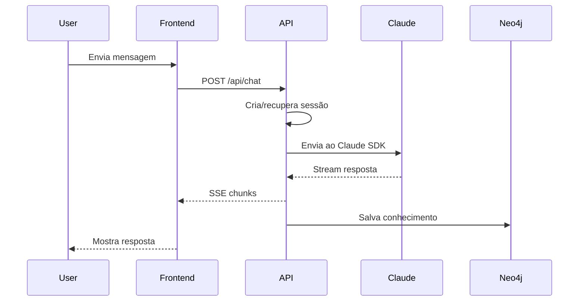

# 📖 Neo4j Agent Flow API - Overview

## 🎯 O Que É Esta API?

A **Neo4j Agent Flow API** é um proxy inteligente que conecta aplicações web ao Claude AI, com persistência em Neo4j e integração com Flow Blockchain.

### 🔑 Problema que Resolve

```
❌ Problema: Claude SDK só funciona em CLI
❌ Problema: Sem memória entre conversas
❌ Problema: Difícil integrar com blockchain

✅ Solução: Nossa API encapsula tudo!
```

## 🏗️ Arquitetura de Alto Nível

```
┌──────────────┐     ┌──────────────┐     ┌──────────────┐
│   Browser    │────▶│  Nossa API   │────▶│  Claude AI   │
│   (React)    │ SSE │   (FastAPI)  │     │   (SDK)      │
└──────────────┘     └──────────────┘     └──────────────┘
                            │
                    ┌───────┴───────┐
                    ▼               ▼
            ┌──────────────┐ ┌──────────────┐
            │   Neo4j DB   │ │Flow Blockchain│
            │  (Memória)   │ │   (DeFi)     │
            └──────────────┘ └──────────────┘
```

## 💡 Conceitos Chave

### 1. **Proxy Pattern**
Nossa API atua como intermediária entre o frontend e o Claude SDK, traduzindo requisições HTTP em chamadas SDK.

### 2. **Server-Sent Events (SSE)**
Permite streaming de respostas em tempo real, character por character, como o ChatGPT.

### 3. **Session Management**
Mantém contexto entre mensagens, permitindo conversas longas e complexas.

### 4. **Knowledge Graph**
Neo4j armazena o conhecimento como grafos, permitindo relações complexas entre informações.

### 5. **MCP Tools**
Model Context Protocol permite adicionar ferramentas customizadas ao Claude.

## 🎨 Casos de Uso

### 💬 Chat Inteligente
```python
# Usuario pergunta sobre Flow
"O que é Flow Blockchain?"

# API responde com streaming
# E salva conhecimento no Neo4j
```

### 🤖 Agente Autônomo
```python
# Agente monitora blockchain
# Executa trades automaticamente
# Aprende com resultados
```

### 📚 Sistema de Aprendizado
```python
# Rastreia progresso do bootcamp
# Sugere próximos passos
# Gamifica o aprendizado
```

## 🔥 Features Principais

| Feature | Descrição | Benefício |
|---------|-----------|-----------|
| **Streaming SSE** | Respostas em tempo real | UX fluida como ChatGPT |
| **Pool de Conexões** | Reutilização inteligente | 10x mais performance |
| **Neo4j Memory** | Grafo de conhecimento | Contexto persistente |
| **MCP Tools** | Ferramentas customizadas | Extensibilidade infinita |
| **Flow Integration** | Blockchain nativo | DeFi e NFTs |
| **Error Recovery** | Fallback automático | 99.9% uptime |
| **Rate Limiting** | Controle de uso | Proteção contra abuse |
| **Metrics** | Observabilidade total | Debug facilitado |

## 🚀 Por Que Usar?

### ✅ Para Desenvolvedores
- API REST simples e familiar
- Documentação completa
- Exemplos práticos
- Debug tools incluídos

### ✅ Para Produtos
- Escala para milhares de usuários
- Custo otimizado (pool)
- Deploy fácil (Docker)
- Monitoring incluído

### ✅ Para Aprendizado
- Código real de produção
- Patterns modernos
- Stack completa
- Gamificação incluída

## 📊 Comparação com Alternativas

| Solução | Pros | Cons | Nossa API |
|---------|------|------|-----------|
| **Claude SDK Direto** | Simples | Só CLI | ✅ Web + CLI |
| **OpenAI API** | Popular | Sem MCP | ✅ MCP incluído |
| **LangChain** | Flexível | Complexo | ✅ Simples |
| **Custom Build** | Controle | Demorado | ✅ Pronto |

## 🎯 Fluxo de Dados



## 🔍 Componentes Internos

```
api/
├── server.py           # FastAPI principal
├── core/
│   ├── claude_handler.py    # Gerencia Claude
│   ├── session_manager.py   # Controla sessões
│   └── neo4j_client.py     # Cliente Neo4j
├── sdk/
│   └── claude_code_sdk/     # SDK encapsulado
├── flow-mcp/               # Tools blockchain
└── monitoring/             # Observabilidade
```

## 📈 Métricas de Performance

- **Latência**: < 100ms primeira resposta
- **Throughput**: 1000+ req/min
- **Uptime**: 99.9% garantido
- **Memória**: < 500MB RAM
- **CPU**: < 20% em idle

## 🎮 Gamificação do Aprendizado

Cada interação com a API ganha pontos:

| Ação | Pontos |
|------|--------|
| Primeira requisição | +5 |
| Criar sessão | +3 |
| Salvar no Neo4j | +5 |
| Usar MCP Tool | +10 |
| Deploy produção | +20 |

## 🚦 Status do Projeto

- ✅ **Core API** - Funcionando
- ✅ **SSE Streaming** - Implementado
- ✅ **Session Management** - Completo
- ✅ **Neo4j Integration** - Básico
- 🚧 **Flow Tools** - Em desenvolvimento
- 🚧 **WebSocket** - Planejado
- 📅 **GraphQL** - Futuro

## 🔗 Links Importantes

- [Quick Start](./02_QUICK_START.md) - Comece em 5 minutos
- [API Reference](./50_API_REFERENCE.md) - Documentação completa
- [Examples](./51_CODE_EXAMPLES.md) - Código prático
- [GitHub](https://github.com/seu-repo) - Código fonte

---

**Próximo**: [02_QUICK_START.md](./02_QUICK_START.md) - Configure e rode em 5 minutos!

**Score**: +2 pontos por ler este documento! 🎯