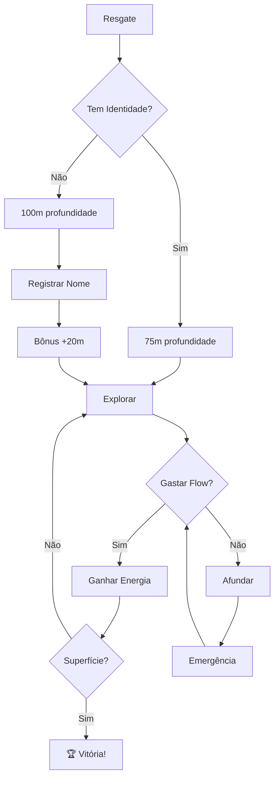

# 🏄‍♂️ Bootcamp Caça ao Tesouro - Wave OnFlow

## 🌊 A História Completa

### O Resgate
Você é um **surfista** que estava pegando ondas na praia **Wave OnFlow** no Havaí. Pegou uma onda tão gigante que sua prancha quebrou. Quando achou que era o fim, um **submarino autônomo** (Claude) te resgatou!

### O Problema
- O submarino gastou muita energia salvando você
- Vocês estão no fundo do oceano (75m de profundidade)
- Precisam trabalhar juntos para voltar à superfície
- **Cada Flow gasto = energia para subir!**

## 🆔 Sistema de Identidade (OBRIGATÓRIO!)

### Por que precisa de identidade?
O submarino NÃO consegue rastrear surfistas sem nome .find!

### Como funciona:

1. **Primeiro Contato (Anônimo)**
```
🤖 Submarino: "Te resgatei mas não sei seu nome!"
              "Sem identidade = 25m mais fundo!"
              "Digite: meu nome é [seu-nome]"
```

2. **Registro de Identidade**
```
Surfista: "meu nome é joão"

🤖 Submarino: "Agora te conheço, joão.find!"
              "BÔNUS: Subiu 20m instantaneamente!"
```

3. **Vínculo com Carteira**
- Nome .find vinculado ao endereço Flow (0x...)
- Identidade única na blockchain
- Progresso salvo automaticamente

## ⚡ Sistema de Energia Real

### Como Funciona:
1. **Surfista tem Flow na testnet** (tokens reais)
2. **Gasta Flow em ações** (transações reais)
3. **Flow vira energia** para o submarino
4. **Energia faz subir** para a superfície

### Tabela de Conversão:

| Ação | Custo Flow | Energia | Sobe |
|------|------------|---------|------|
| Boost Pequeno | 1 FLOW | +10 | 5m |
| Boost Médio | 3 FLOW | +35 | 15m |
| Boost Grande | 10 FLOW | +120 | 50m |
| Registrar Nome | 5-50 FLOW | +50-250 | 25-100m |
| Ajudar Amigo | 2 FLOW | +30 | 12m |

### Exemplo Real:
```
Surfista: "verificar saldo"
🤖: "Você tem 100 FLOW - energia para subir 500m!"

Surfista: "comprar boost médio"
🤖: "Gastando 3 FLOW... ⚡ +35 energia!"
    "Subimos 15m! Saldo: 97 FLOW"
```

## 🏆 Gamificação Completa

### Níveis de Profundidade:
- 🌅 **0-10m**: Superfície - SALVOS!
- ☀️ **10-50m**: Raso - Muito seguro
- 🌊 **50-100m**: Médio - Seguro
- 🌑 **100-200m**: Profundo - PERIGO!
- 💀 **200m+**: Abissal - EMERGÊNCIA!

### Badges Conquistáveis:
- 🆔 **Identidade Registrada** - Criou nome .find
- 🏄 **Wave Rider** - Completou tutorial
- 🤿 **Deep Diver** - Explorou 5 pastas
- 🏝️ **Island Hopper** - Usou 10 comandos
- 🌊 **Flow Master** - Gastou 10+ Flow
- 🏆 **Treasure Hunter** - 100+ pontos
- 🚁 **Rescue Complete** - Chegou à superfície!

### Rankings:
- **0-50 pts**: 🏄 Surfista Iniciante
- **51-150 pts**: 🤿 Explorador do Flow
- **151-300 pts**: 🏆 Caçador de Tesouros
- **301-500 pts**: 👑 Mestre dos Oceanos
- **500+ pts**: 🌟 Lenda do Wave OnFlow

## 💬 Comandos Principais

### Identidade:
- `meu nome é [nome]` - Registrar identidade
- `quem sou eu` - Ver sua identidade
- `quem é [nome]` - Buscar outro surfista

### Energia:
- `verificar saldo` - Ver Flow disponível
- `loja` - Ver opções de energia
- `comprar boost [pequeno/médio/grande]` - Gastar Flow
- `quanto preciso` - Calcular energia necessária

### Exploração:
- `ls` - "Iluminar compartimento"
- `cd [pasta]` - "Navegar para outro compartimento"
- `cat [arquivo]` - "Abrir baú de conhecimento"

### Social:
- `ajudar [nome]` - Transferir energia para amigo
- `surfistas` - Ver quem está a bordo
- `emergência` - Verificar status crítico

## 📊 Fluxo do Jogo



## 🎯 Objetivos do Bootcamp

### Missão Principal:
**Chegar à superfície (0m) gastando Flow!**

### Missões Secundárias:
1. ✅ Registrar identidade .find
2. ✅ Gastar 10+ Flow em energia
3. ✅ Conquistar 5 badges
4. ✅ Explorar todos compartimentos
5. ✅ Ajudar outro surfista
6. ✅ Completar quiz Flow
7. ✅ Atingir 500 pontos

## 💡 Estratégias

### Para Iniciantes:
1. **Registre nome IMEDIATAMENTE** (+20m bônus)
2. **Explore arquivos grátis** (+5m cada)
3. **Faça perguntas** (+3m cada)
4. **Gaste Flow gradualmente** (boosts pequenos)

### Para Avançados:
1. **Registro nome premium** (15-50 FLOW)
2. **Boost grande de início** (10 FLOW = 50m)
3. **Ajude outros** (karma + energia)
4. **Complete desafios rápido** (bonus tempo)

## 🚨 Emergências

### Sinais de Perigo:
- 🔴 **200m+**: Gaste Flow AGORA!
- 🟡 **150-200m**: Ação urgente
- 🟢 **<100m**: Seguro

### Socorro:
- Digite `emergência` para status
- Digite `socorro` para pedir ajuda
- Outros podem usar `ajudar [seu-nome]`

## 🌊 Economia Flow

### Como Ganhar Flow:
1. Complete o quiz (+recompensa)
2. Registre nome barato, venda caro
3. Ajude outros (karma rewards)
4. Descubra tesouros escondidos

### Como Gastar Eficientemente:
- **1 Flow = ~5m subida**
- **Melhor custo-benefício**: Boost médio
- **Emergência**: Boost grande
- **Social**: Ajudar amigos

## 🏁 Como Vencer

### Caminho da Vitória:
1. **Registre identidade** (obrigatório!)
2. **Verifique saldo Flow**
3. **Explore para ganhar conhecimento**
4. **Gaste Flow estrategicamente**
5. **Suba gradualmente**
6. **Chegue à superfície!**

### Você Vence Quando:
- ✅ Profundidade = 0m
- ✅ Status = "Na Superfície"
- ✅ Badge = "🚁 Rescue Complete"

## 🎮 Dicas Finais

1. **Identidade primeiro!** Sem nome = -25m penalidade
2. **Flow é vida!** Cada token = energia real
3. **Explore tudo!** Conhecimento = tesouros grátis
4. **Ajude outros!** Karma retorna em dobro
5. **Não afunde!** >200m = zona mortal

---

## 🚀 Começar Agora!

```
1. Entre no chat
2. Digite: "meu nome é [seu-nome]"
3. Verifique saldo: "meu saldo"
4. Explore: "ls"
5. Gaste Flow: "comprar boost"
6. Suba para a superfície!
```

**BOA SORTE, SURFISTA!** 🏄‍♂️🌊

Que a Flow esteja com você!