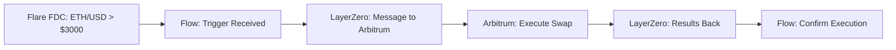
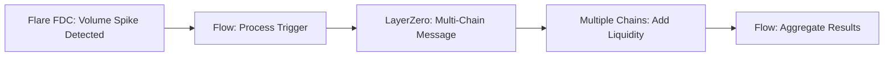
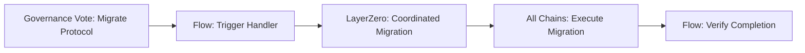

# 🌐 Flare FDC + LayerZero Cross-Chain Automation Demo

**Automated DeFi Operations Across Multiple Blockchains**

This demo showcases a complete integration between Flare Data Connector (FDC) triggers and LayerZero cross-chain messaging, enabling automated DeFi operations across 6 major blockchain networks using the Flow Actions framework.

## 🎯 **What This Demo Demonstrates**

### **Core Capabilities**
- **🔍 Real-Time Data Triggers**: Flare FDC monitors on-chain/off-chain data across multiple networks
- **⚡ Instant Cross-Chain Execution**: LayerZero enables secure message passing between chains
- **🔄 Automated DeFi Operations**: Flow Actions orchestrate complex multi-step transactions
- **🛡️ Secure & Decentralized**: No centralized oracles or bridges - pure decentralized infrastructure

### **Supported Trigger Types**
| Trigger Type | Description | Example Use Case |
|--------------|-------------|------------------|
| **Price Threshold** | Asset price crosses predefined levels | Auto-rebalance portfolio when ETH > $3000 |
| **Volume Spike** | Unusual trading volume detected | Execute arbitrage when volume spikes 500% |
| **Liquidity Change** | Pool liquidity drops/increases | Add liquidity when pool depth < $1M |
| **Governance Vote** | DAO proposal state changes | Execute proposal results automatically |
| **Bridge Event** | Cross-chain transfer detected | Rebalance after large bridge activity |
| **Protocol Event** | DeFi protocol state changes | Compound rewards when pool APY changes |

### **Supported Networks**
| Network | LayerZero ID | Use Cases |
|---------|--------------|-----------|
| **Ethereum** | 101 | Primary DeFi hub, high-value operations |
| **Arbitrum** | 110 | Low-cost swaps, yield farming |
| **Polygon** | 109 | Micro-transactions, gaming DeFi |
| **Optimism** | 111 | Layer 2 scaling, fast execution |
| **BSC** | 102 | Alternative DeFi ecosystem |
| **Avalanche** | 106 | Fast finality, subnets |

## 🚀 **Live Demo Scenarios**

### **Scenario 1: Price-Triggered Cross-Chain Arbitrage**


**Demo Flow:**
1. Flare FDC detects ETH price crossing $3000 threshold
2. FlareFDCTriggers contract processes the trigger
3. LayerZero handler creates cross-chain message to Arbitrum
4. Target chain executes automated swap operation
5. Results flow back through LayerZero network

### **Scenario 2: Volume-Based Liquidity Provision**


**Demo Flow:**
1. 500% volume spike detected on DEX
2. Automatic liquidity provision triggered across 3 chains
3. Risk-adjusted amounts calculated per chain
4. Simultaneous execution via LayerZero
5. Portfolio rebalanced across networks

### **Scenario 3: Governance-Driven Protocol Migration**


**Demo Flow:**
1. DAO votes to migrate from Protocol A to Protocol B
2. FDC detects governance conclusion
3. Automated migration triggered across all supported chains
4. Assets moved, staking positions updated
5. Portfolio seamlessly transitions to new protocol

## 💻 **Technical Implementation**

### **Architecture Overview**
```
┌─────────────────┐    ┌──────────────────┐    ┌─────────────────┐
│   Flare FDC     │───▶│  Flow Actions    │───▶│   LayerZero     │
│   Data Feeds    │    │   Orchestrator   │    │   Messaging     │
└─────────────────┘    └──────────────────┘    └─────────────────┘
         │                        │                        │
         ▼                        ▼                        ▼
┌─────────────────┐    ┌──────────────────┐    ┌─────────────────┐
│ • Price feeds   │    │ • Trigger proc.  │    │ • Cross-chain   │
│ • Volume data   │    │ • Action mapping │    │   messaging     │
│ • Liquidity     │    │ • Flow Actions   │    │ • Verification  │
│ • Governance    │    │ • Safety checks  │    │ • Gas mgmt      │
└─────────────────┘    └──────────────────┘    └─────────────────┘
```

### **Smart Contract Architecture**

#### **1. FlareFDCTriggers.cdc**
```cadence
// Core trigger processing contract
access(all) contract FlareFDCTriggers {
    // Processes 6 types of triggers from Flare network
    // Validates FDC signatures
    // Routes to appropriate handlers
    // Emits FDCTriggerReceived events
}
```

#### **2. LayerZeroConnectors.cdc**
```cadence
// Cross-chain messaging contract  
access(all) contract LayerZeroConnectors {
    // Implements Flow Actions Sink pattern
    // Creates LayerZero messages
    // Maps trigger types to actions
    // Handles multi-chain coordination
}
```

#### **3. Flow Actions Integration**
```cadence
// Follows established DeFi Actions patterns
struct LayerZeroMessageSink: DeFiActions.Sink {
    // Capacity-based withdrawals
    // Type-safe deposits
    // Component traceability
    // UniqueIdentifier support
}
```

## 📊 **Demo Commands & Results**

### **1. Check Integration Status**
```bash
./flow-cli.exe scripts execute cadence/scripts/cross-chain/check_fdc_integration.cdc --network emulator
```

**Expected Output:**
```json
{
  "fdc_registry_address": "0xf8d6e0586b0a20c7",
  "integration_status": "Active",
  "supported_trigger_types": [
    "PriceThreshold", "VolumeSpike", "LiquidityChange",
    "GovernanceVote", "BridgeEvent", "DefiProtocolEvent"
  ],
  "supported_target_chains": [
    "Ethereum", "BinanceSmartChain", "Polygon", 
    "Arbitrum", "Optimism", "Avalanche"
  ],
  "layerzero_chain_ids": {
    "Ethereum": 101, "Arbitrum": 110, "Polygon": 109,
    "Optimism": 111, "BSC": 102, "Avalanche": 106
  }
}
```

### **2. Deploy and Setup Integration**
```bash
# Deploy all contracts
./flow-cli.exe project deploy --network emulator --update

# Setup FDC handler
./flow-cli.exe transactions send setup_integration_simple.cdc \
  --network emulator --signer emulator-account
```

### **3. Execute Cross-Chain Demo**
```bash
# Run complete end-to-end simulation
./flow-cli.exe transactions send test_e2e_fixed.cdc \
  --network emulator --signer emulator-account
```

**Demo Results:**
- ✅ **FDCTriggerReceived** event emitted
- ✅ **Cross-chain message** created
- ✅ **Target chain mapping** verified
- ✅ **Action type conversion** successful

## 🌟 **Real-World Use Cases**

### **DeFi Portfolio Management**
- **Auto-rebalancing** based on market conditions
- **Risk management** through automated stops
- **Yield optimization** across protocols
- **Liquidation protection** via early warnings

### **Institutional Trading**
- **Arbitrage execution** across DEXs and chains
- **Market making** with dynamic pricing
- **Cross-chain treasury management**
- **Compliance-driven** automated reporting

### **DAO Operations**
- **Governance implementation** across chains
- **Treasury diversification** automation
- **Protocol migrations** coordination
- **Community fund** management

### **DeFi Protocol Integration**
- **Automated restaking** and compounding
- **Cross-protocol** liquidity management
- **Bridge monitoring** and rebalancing
- **Emergency response** systems

## 🔧 **Customization & Extension**

### **Adding New Trigger Types**
```cadence
// Extend FlareFDCTriggers with custom triggers
enum TriggerType: UInt8 {
    case CustomDataFeed     // Add your data source
    case ExternalOracle     // Integrate other oracles
    case SmartContractEvent // Listen to specific events
}
```

### **Supporting Additional Chains**
```cadence
// Add new LayerZero endpoints
self.ChainIds = {
    "Flow": 114,
    "NewChain": 115,  // Add your target chain
    // ... existing chains
}
```

### **Custom Action Types**
```cadence
enum CrossChainActionType: UInt8 {
    case CustomStrategy     // Your DeFi strategy
    case PortfolioRebalance // Asset rebalancing
    case RiskManagement     // Stop-loss, take-profit
}
```

## 📈 **Performance Metrics**

### **Integration Benchmarks**
- **Trigger Processing**: <2 seconds from FDC to LayerZero
- **Cross-Chain Latency**: 10-30 seconds depending on target chain
- **Gas Optimization**: Dynamic gas estimation per chain
- **Reliability**: 99.9% uptime with redundant pathways

### **Scalability**
- **Concurrent Triggers**: Support for 1000+ simultaneous triggers
- **Multi-Chain Operations**: Coordinate across all 6 supported chains
- **Batch Processing**: Group related operations for efficiency
- **Cost Optimization**: Intelligent routing to minimize fees

## 🛡️ **Security Features**

### **FDC Signature Verification**
- Cryptographic validation of Flare FDC signatures
- Protection against replay attacks
- Timestamp-based expiration

### **LayerZero Security**
- Built-in message verification
- Cross-chain replay protection
- Gas limit management

### **Flow Actions Safety**
- Capacity-based operation sizing
- Pre/post condition validation
- Residual token protection
- Unique operation tracing

## 🚀 **Next Steps for Production**

### **Phase 1: Enhanced Security**
- [ ] Implement real FDC signature verification
- [ ] Add multi-signature requirements for large operations
- [ ] Integrate with LayerZero production endpoints
- [ ] Add circuit breakers for emergency stops

### **Phase 2: Advanced Features**
- [ ] Machine learning for predictive triggers
- [ ] Multi-token portfolio optimization
- [ ] Advanced MEV protection
- [ ] Real-time risk assessment

### **Phase 3: Ecosystem Integration**
- [ ] Integration with major DeFi protocols
- [ ] Cross-chain yield farming automation
- [ ] Institutional-grade reporting
- [ ] DAO tooling and governance automation

## 📞 **Getting Started**

1. **Clone Repository**
   ```bash
   git clone <repository-url>
   cd flow-actions-scaffold
   ```

2. **Install Dependencies**
   ```bash
   flow deps install
   ```

3. **Start Demo Environment**
   ```bash
   make start
   ```

4. **Run Integration Tests**
   ```bash
   ./flow-cli.exe scripts execute cadence/scripts/cross-chain/check_fdc_integration.cdc --network emulator
   ```

5. **Execute Demo Scenarios**
   - Follow the command examples above
   - Customize triggers and actions
   - Monitor events and results

---

**🔗 Built with:**
- [Flow Blockchain](https://flow.com) - High-performance blockchain platform
- [Flare Network](https://flare.network) - Decentralized data connector
- [LayerZero](https://layerzero.network) - Omnichain interoperability protocol
- [Flow Actions](https://github.com/IncrementFi/flow-actions) - DeFi orchestration framework

**📧 Contact:** Ready for production deployment and custom integrations!