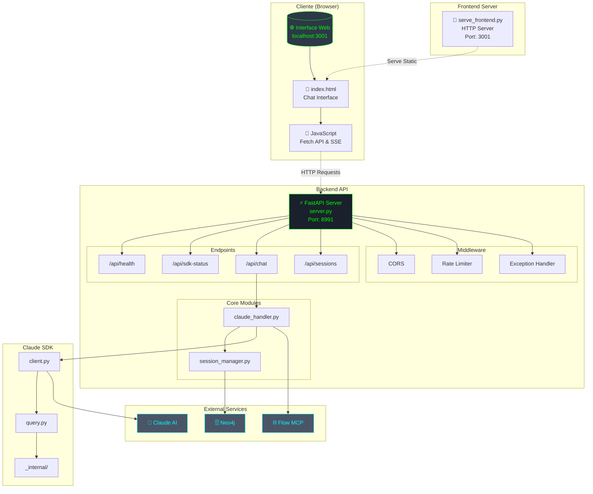
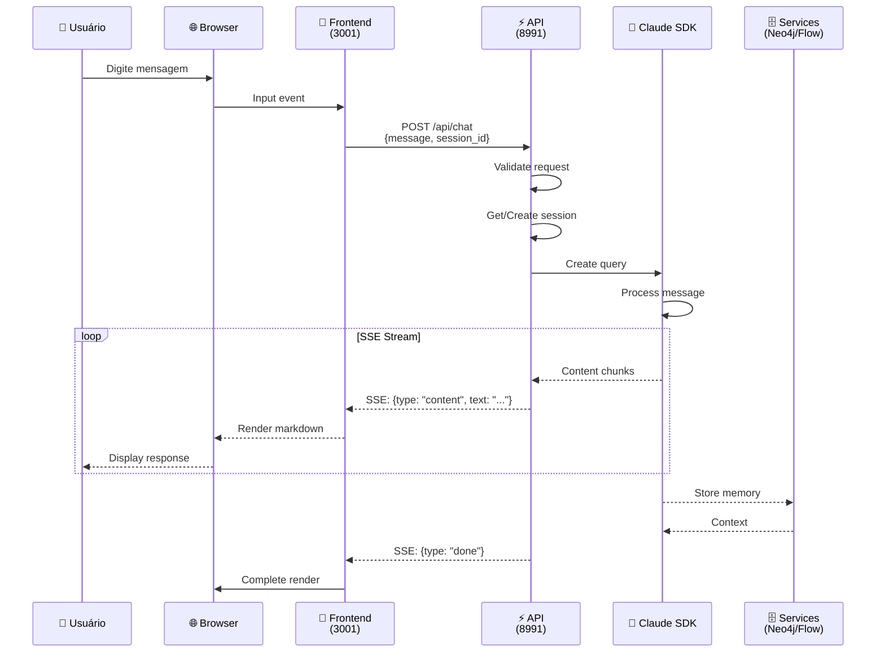
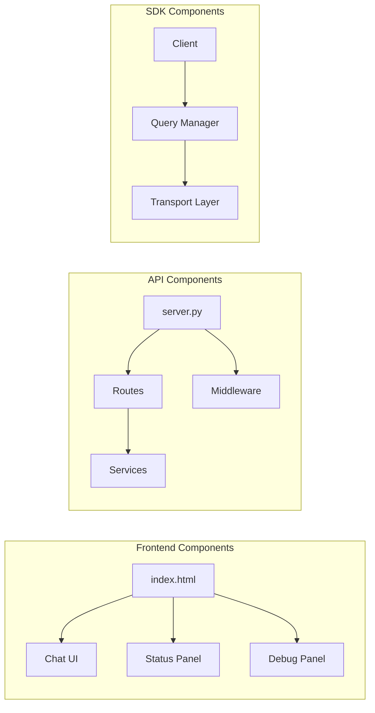
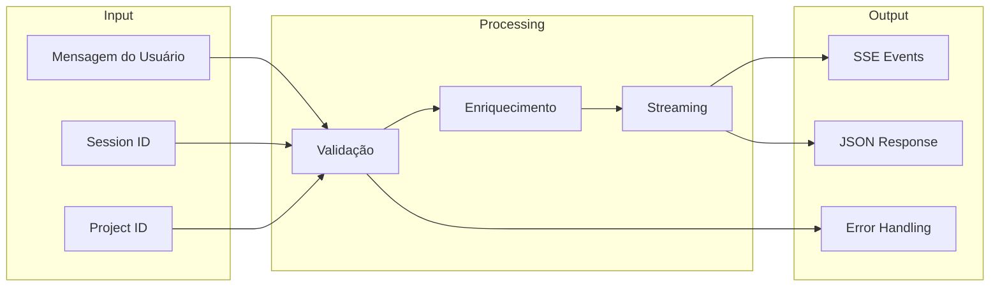
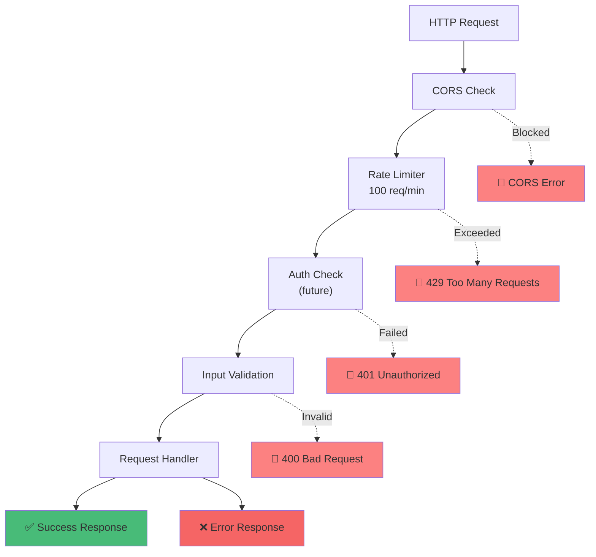
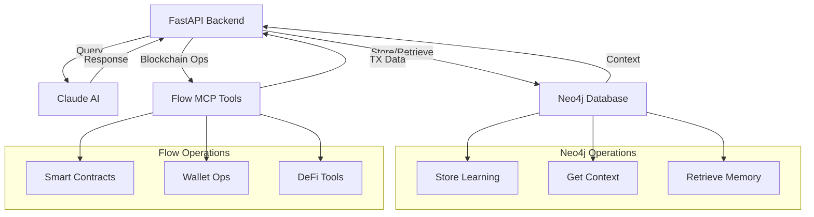
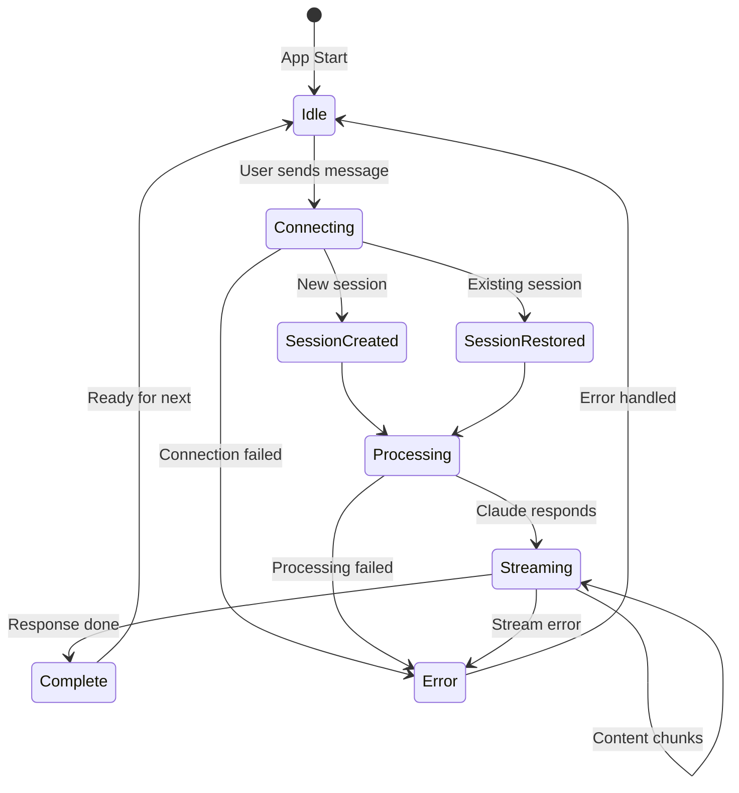
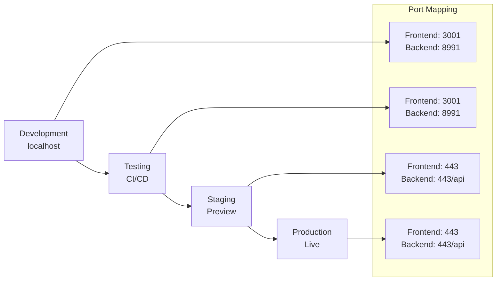
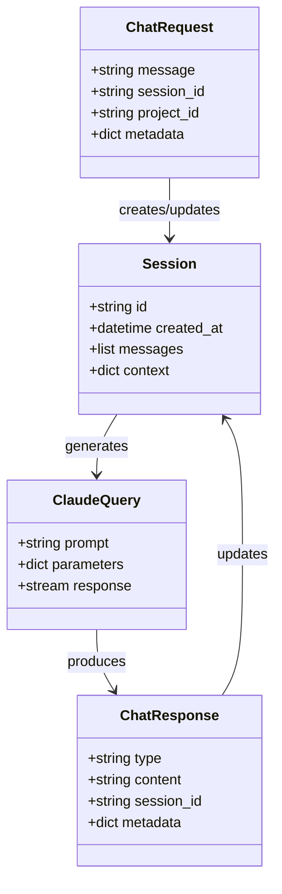
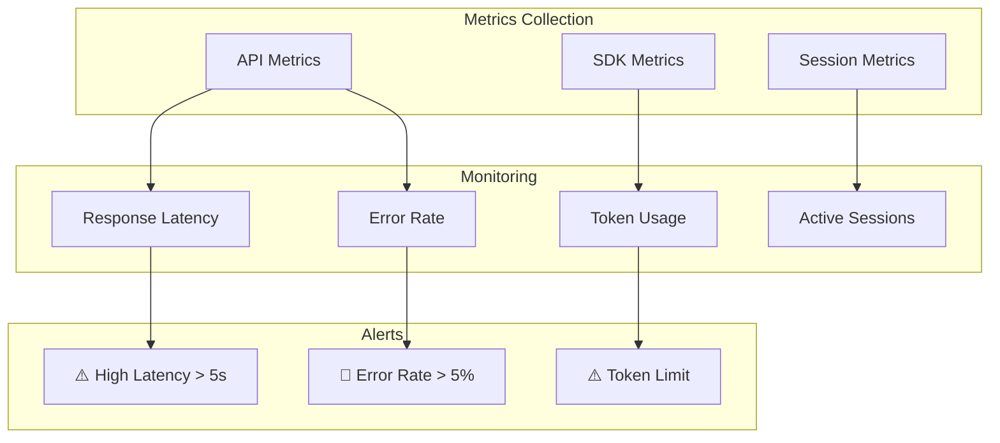

# 🏗️ Arquitetura do Sistema - Diagramas Mermaid

## 📊 Visão Geral da Arquitetura

## 🔄 Fluxo de Comunicação

## 📦 Estrutura de Componentes

## 🔀 Fluxo de Dados

## 🛡️ Arquitetura de Segurança

## 🔌 Integração de Serviços

## 📈 Estados da Aplicação

## 🚀 Deploy Pipeline

## 💾 Estrutura de Dados

## 📊 Métricas e Monitoramento

---

## 🔗 Como Visualizar os Diagramas

### Opção 1: GitHub
- Copie o código Mermaid e cole em um arquivo `.md` no GitHub
- O GitHub renderiza automaticamente

### Opção 2: Mermaid Live Editor
- Acesse: https://mermaid.live
- Cole o código Mermaid
- Exporte como PNG/SVG

### Opção 3: VS Code
- Instale a extensão "Markdown Preview Mermaid Support"
- Abra este arquivo no VS Code
- Use o preview (Ctrl+Shift+V)

### Opção 4: Obsidian
- Cole o código em uma nota
- Obsidian renderiza nativamente

---

## 📝 Legenda dos Ícones

- 🌐 **Frontend/Browser**
- ⚡ **FastAPI Backend**
- 🤖 **Claude AI**
- 🗄️ **Database (Neo4j)**
- ⛓️ **Blockchain (Flow)**
- 📄 **HTML/Documents**
- 🔧 **Scripts/Tools**
- ✅ **Success**
- ❌ **Error**
- ⚠️ **Warning**
- 🚨 **Critical Alert**